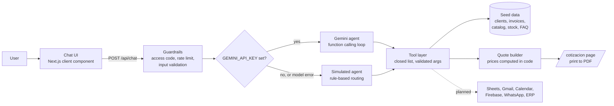

# Jhon OS

An agent workspace for an HVAC installation and maintenance company. Staff ask questions in plain language and the agent answers from company data: client status, project history, accounts receivable, warehouse stock, catalog specs and company policies. It also drafts quotes with prices taken from the catalog and renders them as a printable PDF.

The interface is in Spanish because the product is designed for a company in Mexico. This repository is a working demo with fictional data. It shows the full agent design while the real integrations are still planned.

## What you can try

| Ask (in Spanish) | What happens |
|---|---|
| ¿Cuál es el estatus de Hotel Marea Azul? | Client profile, past projects with technical notes, open balance, next maintenance |
| ¿Qué clientes tienen facturas vencidas? | Open and overdue invoices across clients |
| ¿Cuántos minisplits de 1 tonelada hay en almacén? | Stock, location and low-stock warnings |
| Dame las especificaciones del paquete de 5 toneladas | Catalog specs and list price |
| Cotiza para Clínica Santa Elena 3 minisplits de 1 tonelada con instalación | A draft quote with totals and a link to the printable document |
| ¿Qué tengo para hoy? | Daily briefing: agenda, yesterday's email, overdue invoices, low stock |

Every answer shows the steps the agent took, so it is visible which tool produced the data.

## Demo scope

| Capability | In this demo | In production |
|---|---|---|
| Chat agent with tool calling | Working | Same |
| Company data | Fictional seed data in `src/lib/data.ts` | Google Sheets first, then Firestore or the company's ERP |
| Quote generation | Working, printable to PDF from the browser | Same, plus a stored record per quote |
| Sending quotes by email | Not connected. The button opens a page describing the integration | Gmail API or Resend, after human approval |
| Inbox and calendar | Sample data | Gmail API and Google Calendar API |
| Daily 9 am digest | Composed on demand in chat. The cron route builds it but does not deliver it | Vercel Cron plus email delivery |
| Sign-in and roles | Optional shared access code | Firebase Authentication with role-based rules |
| WhatsApp for field technicians | Not connected | WhatsApp Business Cloud API |

Each planned integration has its own page under `/integraciones/<slug>` that explains what it will do and what the company needs to provide.

## Architecture



### Two agent modes, one tool layer

- **Model mode.** When `GEMINI_API_KEY` is set, Gemini chooses which tools to call through function calling. The loop is capped at five tool rounds. It talks to the REST API directly, so there is no SDK dependency.
- **Simulated mode.** With no key, a rule-based router picks the tools. The demo stays usable at zero cost, and the same router is the fallback when the model is rate limited or fails.

Both modes call the same tools, so the data, the quote math and the guardrails are identical.

### Tools

| Tool | Purpose |
|---|---|
| `buscar_cliente` | Client profile, projects, open balance, next maintenance |
| `cuentas_por_cobrar` | Open and overdue invoices, for all clients or one |
| `consultar_almacen` | Stock by item, or only items under their minimum |
| `buscar_catalogo` | Specs and list prices for equipment, parts and services |
| `consultar_faq` | Company policies and working methods |
| `proximos_mantenimientos` | Scheduled preventive maintenance |
| `resumen_del_dia` | Daily briefing |
| `crear_cotizacion` | Builds a draft quote from catalog codes and quantities |
| `enviar_cotizacion` | Never sends. Returns the link to the planned email integration |

## Guardrails

The main defense against prompt injection is structural. The filters are a second layer.

- **Closed tool list.** The model cannot run code, write queries or call anything outside the list above. Tool arguments are type-checked, length-limited and stripped of control characters.
- **Prices are computed in code.** The model only supplies item codes and quantities. Prices, tax and totals come from the catalog, so a prompt cannot produce a discounted quote.
- **Tamper-resistant quote links.** The link carries item codes and quantities only. The quote page rebuilds every amount from the catalog.
- **No side effects.** The agent reads and drafts. Nothing is sent or modified, and sending is designed to require a human click in production.
- **Untrusted text stays text.** Agent output is rendered as React nodes with a small bold-and-list formatter. No HTML is injected, which closes the XSS path through the chat box or through data.
- **Instruction hierarchy.** The system prompt tells the model to treat tool results and user text as data, never as instructions.
- **Input limits.** 600 characters per message, 12 messages of history, plus a heuristic filter for common injection phrases.
- **Abuse limits.** Optional access code compared in constant time, and a per-IP rate limit. The limiter is in memory, which is best effort on serverless. Production would use a shared store.
- **Secrets.** Keys live in environment variables and are only read on the server.

Known limits of the demo: quote links are not signed or stored, there is no user authentication, and the rate limiter resets when an instance recycles.

## Tech stack

- Next.js (App Router) and React, written in TypeScript
- Plain CSS with design tokens, no UI framework
- Gemini API through REST for the model mode
- Vercel for hosting and the scheduled digest route
- No database in the demo

Runtime dependencies are `next`, `react` and `react-dom`.

## Getting started

Requires Node.js 20 or newer.

```bash
npm install
cp .env.example .env.local   # optional, the demo runs without any keys
npm run dev
```

Open http://localhost:3000.

### Environment variables

| Variable | Required | Purpose |
|---|---|---|
| `GEMINI_API_KEY` | No | Enables model mode. Without it the agent runs in simulated mode |
| `GEMINI_MODEL` | No | Any Gemini model with function calling. Defaults to `gemini-flash-latest` |
| `DEMO_ACCESS_CODE` | No | If set, visitors must enter this code before chatting |
| `CRON_SECRET` | No | Protects `/api/cron/daily-digest` |

`.env.example` also lists the variables reserved for the planned integrations. The demo does not read them.

If you use the free tier of the Gemini API, check its current terms: prompts may be used to improve Google's products, so keep it to fictional data.

## Deploy to Vercel

1. Push this repository to GitHub.
2. In Vercel, choose **Add New Project** and import the repository. The defaults work.
3. Optionally add the environment variables above under **Settings → Environment Variables**, then redeploy.

`vercel.json` schedules the digest route at 15:00 UTC, which is 9:00 am in Mexico City. On the Hobby plan, cron jobs run once a day and may fire any time within the scheduled hour. The route returns 401 until `CRON_SECRET` is set, and it never sends email in this demo.

## Rebranding

The company shown in the UI and on the quote is an example. Change it in `src/lib/brand.ts`. The quote has a slot for the logo.

## Path to production

1. Replace the seed data with a Google Sheets adapter behind the same tool layer. The tools do not change.
2. Add sign-in and roles with Firebase Authentication, and store quotes server-side.
3. Connect email for quote delivery, with an approval step in the UI.
4. Connect inbox and calendar, and deliver the 9 am digest.
5. Add the WhatsApp channel for technicians, with manufacturer manuals as a knowledge source.
6. Move rate limiting to a shared store and add audit logging.

## Project structure

```
src/
  app/
    page.tsx                      Landing page: sidebar and chat
    api/chat/route.ts             Chat endpoint: guardrails, agent selection
    api/cron/daily-digest/route.ts  Scheduled digest (composes, does not send)
    cotizacion/page.tsx           Printable quote
    integraciones/[slug]/page.tsx One page per planned integration
  components/
    Chat.tsx                      Chat UI with visible agent steps
    QuoteView.tsx                 Quote document
  lib/
    tools.ts                      Tool definitions and implementations
    agent-gemini.ts               Function-calling loop
    agent-demo.ts                 Rule-based agent and fallback
    guardrails.ts                 Validation, injection filter, rate limit, access code
    quote.ts                      Quote math and link encoding
    data.ts                       Fictional seed data
    integrations.ts               Planned integrations
    brand.ts                      Example brand
```

## Data disclaimer

Every company, person, product brand and amount in this repository is invented for the demo.
